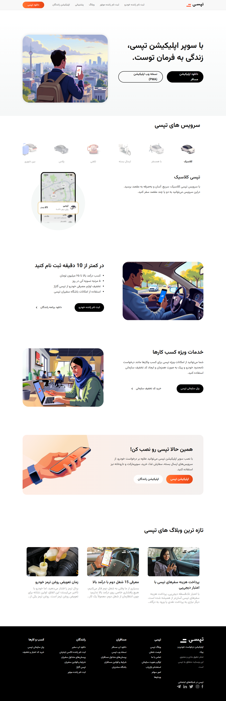
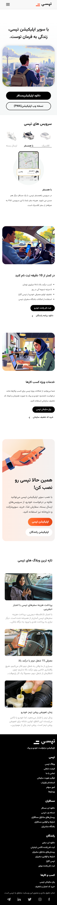

# Project Name: [Tapsi Clone]

## 📖 Overview
A front-end clone of the Tapsi website developed using pure HTML, CSS, and JavaScript to practice real-world responsive design and layout structuring.
This project emphasizes pixel-accurate layouts, mobile-first responsiveness, and modular UI sections, while reproducing core pages such as services, driver onboarding, corporate offerings, app installation prompts, and blog previews.

---

## ✨ Features
- Fully Responsive Design: Optimized for mobile, tablet, and desktop views using Media Queries(Mobile first Approach).
- Clean Architecture: Organized CSS structure for better maintainability.
- A little JavaScript: hamburger menu for mobile navbar and active buttons in services section.

---

## 🛠 Tech Stack
| **Frontend** | HTML5, CSS3, JavaScript (ES6+) |
| **Styling** | Flexbox, CSS Grid, Custom Properties |
| **Icons & Fonts** | tapsiCustom icons , Vazirmatn and Iranyekan font |
| **Tools** | Git, GitHub, VS Code |

## 🖼 Screenshots

### Desktop View

### Mobile View

